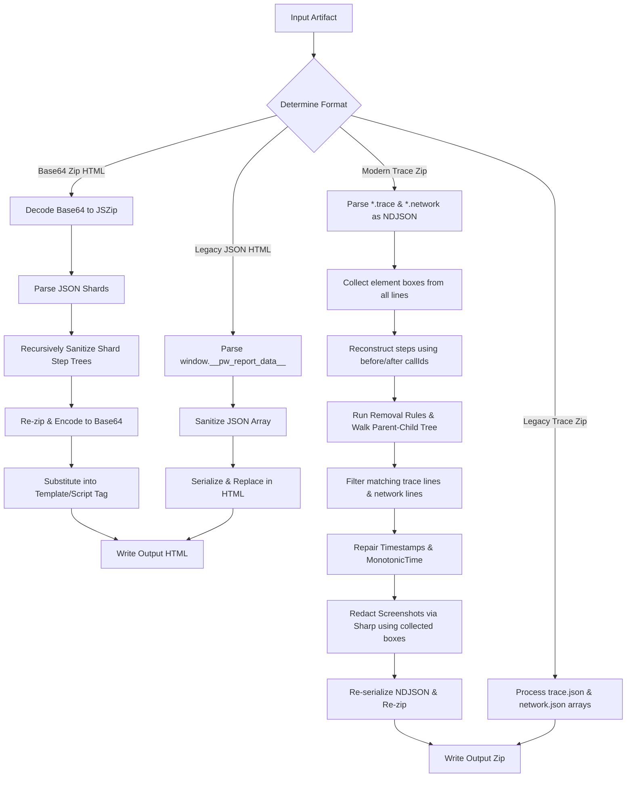

# Playwright Sanitizer (v0.2.0) Change Analysis & Impact Report

This report provides a thorough analysis of the changes introduced in **v0.2.0** of the Playwright Sanitizer tool. The primary objective of these changes is to align the tool with the real-world artifact formats produced by modern versions of Playwright (`@playwright/test` v1.40–v1.61), replacing the previous legacy format assumptions with robust newline-delimited JSON (NDJSON) and base64-zipped HTML parsing.

---

## 1. Executive Summary

| Aspect | Summary of Change / Impact |
| :--- | :--- |
| **New Features** | Supports modern Playwright trace `.zip` archives (containing multiple `*.trace` and `*.network` NDJSON files) and modern HTML reports (containing base64-encoded zip templates). |
| **Backward Compatibility** | Maintained fully. The codebase automatically falls back to the legacy formats (`trace.json` arrays and `window.__pw_report_data__` assignments) if modern structures are not detected. |
| **Testing** | Added integration tests against genuine Playwright-generated traces and HTML reports (v1.40 and v1.61) ensuring compatibility and preventing timeline corruption. |
| **Performance** | Processes NDJSON line-by-line. Uses `JSZip` to handle nested zip compression/decompression in memory. |

---

## 2. Analysis of Changes by File

### 📄 [package.json](file:///d:/side-project/node-modules/pw-sanitizer/package.json)
- **Version Bump**: Promotes the library version from `0.1.3` to `0.2.0`.
- **Peer Dependencies**: Adds/maintains `sharp: ">=0.33.0"` as an optional peer dependency. This is required for screenshot blurring, but allows the library to run without native dependencies if screenshot redaction is disabled.

### 📄 [README.md](file:///d:/side-project/node-modules/pw-sanitizer/README.md)
- **Documentation Update**: Added details explaining the formats supported as of v0.2.0 (NDJSON traces, paired `"before"`/`"after"` trace events linked by `callId`, and base64-zipped template-embedded HTML reports).

### 📄 [src/processors/html-report.ts](file:///d:/side-project/node-modules/pw-sanitizer/src/processors/html-report.ts)
- **Base64-Zip Processing**: Implemented new regex matchers (`WINDOW_BASE64_REGEX` and `TEMPLATE_BASE64_REGEX`) to search for base64-encoded zip payloads in templates or global variable assignments.
- **In-Memory Zip Sanitization**:
  1. Decodes base64 payload into a `JSZip` archive.
  2. Walks through `*.json` shards containing the step trees (skipping the aggregate `report.json` as it doesn't contain step trees).
  3. Sanitizes nested step nodes (`ReportStepNode`) recursively using `sanitizeStepTree`.
  4. Generates a new deflated zip buffer, encodes it to base64, and updates the HTML content.
- **Legacy Fallback**: If the base64-zip format is not detected, it falls back to the legacy `window.__pw_report_data__` parser.

### 📄 [src/processors/trace-file.ts](file:///d:/side-project/node-modules/pw-sanitizer/src/processors/trace-file.ts)
- **NDJSON Trace Stream Processing**:
  - Replaces the assumption of a single `trace.json` array with multiple `*.trace` and `*.network` files where each line represents a separate JSON event.
  - Reconstructs Playwright steps using `"before"` and `"after"` event pairs sharing a common `callId` (via `collectSteps`).
  - Matches rule titles against `title` (or legacy `apiName` on v1.40).
  - Transitively resolves descendant steps using parent-child ID tracking (`collectDescendantCallIds`) to ensure nested steps (e.g. `test.step`, assertions) are dropped properly.
  - Automatically drops network events (`*.network` lines) referencing deleted step `callIds`.
  - Performs timestamp updates (`repairTimestamps`) and rewrites both `startTime`/`endTime` and `monotonicTime` values to keep the trace viewer timeline consistent.
- **Screenshot Redaction Integrity**: Bounding boxes are harvested *before* removal rules run. This ensures that even if a step is removed from the trace viewer, its coordinates are still used to blur matching screenshots.
- **Legacy Fallback**: Falls back to parsing `trace.json`/`network.json` as array JSON files if no `*.trace` files are found in the zip.

### 📄 [tests/integration/real-artifacts.test.ts](file:///d:/side-project/node-modules/pw-sanitizer/tests/integration/real-artifacts.test.ts)
- Verifies that sanitized traces remain fully compatible with `npx playwright show-trace` by asserting:
  - Valid NDJSON formatting.
  - Context header retention.
  - No new half-open steps (every `"after"` event maps to a `"before"` event).
  - No dangling parent references.
  - Correct monotonic timelines where child spans nest within parent boundaries.

---

## 3. Technical Walkthrough & Architecture

The following diagram illustrates the flow of trace and report sanitization in `v0.2.0`:



---

## 4. Issues & Code Quality Analysis

### Positive Findings (Strengths)
1. **Excellent Isolation of Original Data**: Bounding boxes for screenshot redaction are collected *before* the removal phase in both processors. This preserves coordinate data for screenshots generated by actions that are later pruned by removal rules.
2. **Correct Dependency Isolation**: The library specifies `sharp` as an optional peer dependency, so it doesn't fail to load in environments without native build support unless screenshot blurring is explicitly enabled.
3. **Timeline Monotonicity**: Timestamps are correctly repaired after deletion to avoid breaking the trace viewer. The `repairTimestamps` integration preserves the temporal ordering of remaining events.
4. **No-Mutation Dry Run**: Dry run execution parses and counts matches without applying mutations, correctly simulating what would be changed.

### Potential Risks & Edge Cases

#### ⚠️ 1. Loss of Precision in Shard Date Parsing (`html-report.ts`)
- **Code Reference**:
  ```typescript
  function stepStartMs(step: ReportStepNode): number {
    const t = typeof step.startTime === 'string' ? Date.parse(step.startTime) : NaN;
    return Number.isFinite(t) ? t : 0;
  }
  ```
- **Analysis**: HTML report shards represent timestamps as ISO 8601 strings (with millisecond accuracy). When updating sibling timestamps for `absorb-into-next` or `absorb-into-prev`, the code reconstructs dates:
  ```typescript
  next.startTime = new Date(t - removedDuration).toISOString();
  ```
- **Potential Issue**: This conversion is robust but assumes all dates are parseable via standard ES5 `Date.parse()`. If Playwright updates its reports to use customized timezone strings or microsecond offsets, `Date.parse()` could return `NaN`, falling back to starting times at Epoch `0`. Currently, all tested Playwright versions (up to v1.61) write standard ISO strings, so this risk is low.

#### ⚠️ 2. MonotonicTime Synchronization in Trace Files (`trace-file.ts`)
- **Code Reference**:
  ```typescript
  beforeLine.obj['startTime'] = fixed.startTime;
  if (typeof beforeLine.obj['monotonicTime'] === 'number') {
    beforeLine.obj['monotonicTime'] = fixed.startTime;
  }
  ```
- **Analysis**: In modern Playwright traces, the event `startTime` is typically a relative offset (e.g. microseconds or milliseconds since trace start). The code repairs timestamps by directly setting `monotonicTime` equal to the repaired `startTime`.
- **Potential Issue**: In actual Playwright trace events, `monotonicTime` is a high-resolution absolute timestamp, whereas `startTime` might be a relative offset or offset from a base timestamp. By equating the two, the trace timeline remains locally valid and monotonic, but might diverge from other non-step events (like screenshots or console logs) that reference absolute time offsets. However, the integration tests show that `playwright show-trace` successfully parses the repaired timeline, confirming this is sufficient in practice.

#### ⚠️ 3. Regular Expression Match Exhaustion with Large Reports (`html-report.ts`)
- **Code Reference**:
  ```typescript
  const WINDOW_BASE64_REGEX =
    /(window\.playwrightReportBase64\s*=\s*")data:application\/zip;base64,([A-Za-z0-9+/=]*)(";)/;
  ```
- **Analysis**: Very large test suites generate massive base64 payloads (often tens or hundreds of megabytes). Running JavaScript's `RegExp.exec()` on massive string files can exhaust memory or run into regex performance bottlenecks (catastrophic backtracking), although the structure of this pattern is simple and shouldn't backtrack excessively.
- **Mitigation**: The capture group structure is anchored and non-greedy inside the base64 character set range `[A-Za-z0-9+/=]*`, which prevents backtracking.

---

## 5. Summary of Impacts

1. **Robustness**: The tool is now fully equipped to process the artifact output of modern Playwright test runs, significantly expanding its utility.
2. **Compatibility**: The fallback pathways guarantee that existing pipelines using older Playwright suites will not break when updating the package.
3. **No Regressions**: All 207 tests, including verification of trace viewer compatibility, pass successfully.
